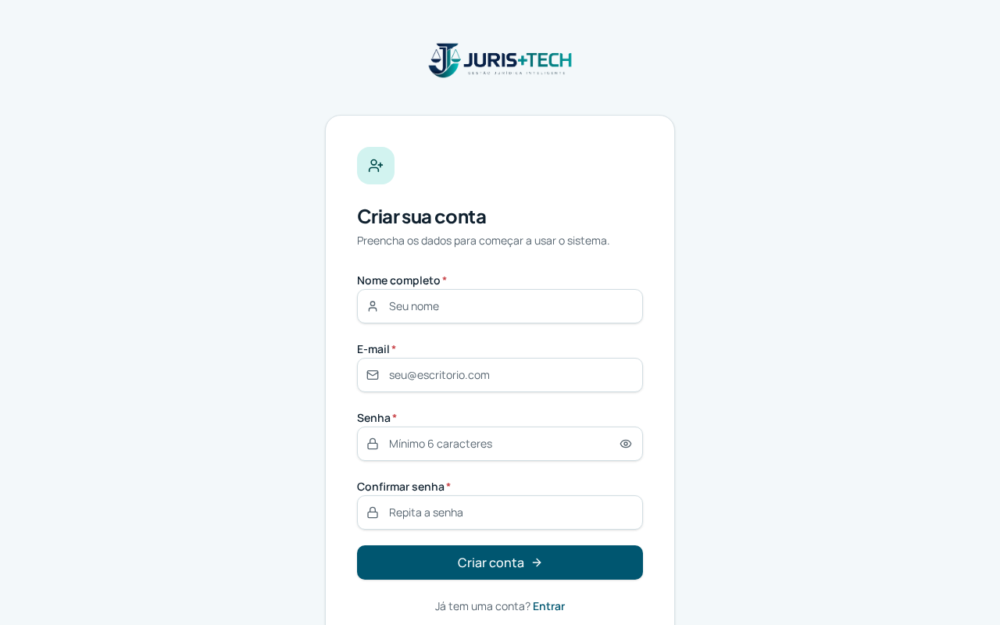
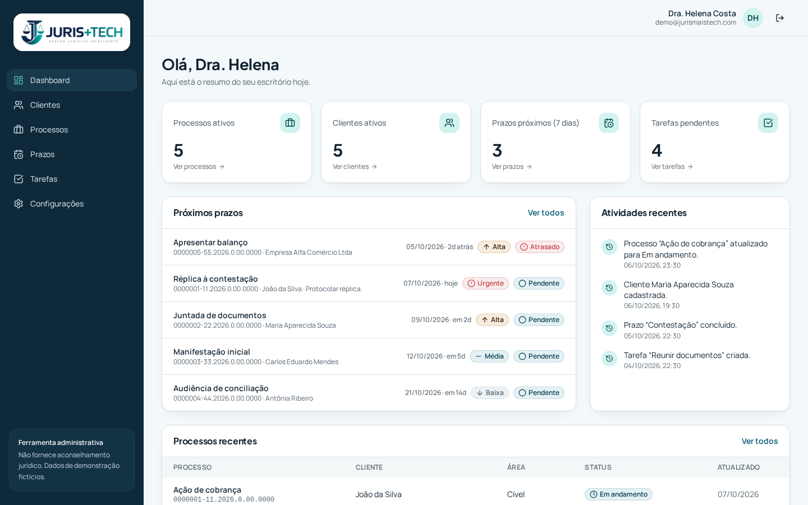
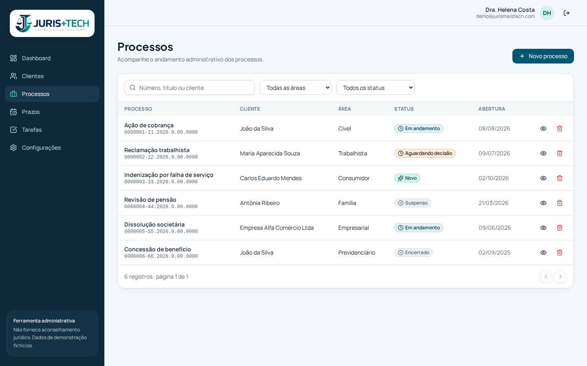
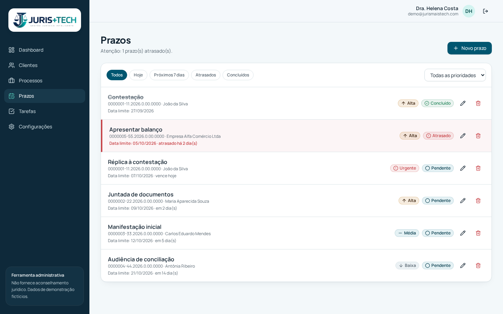
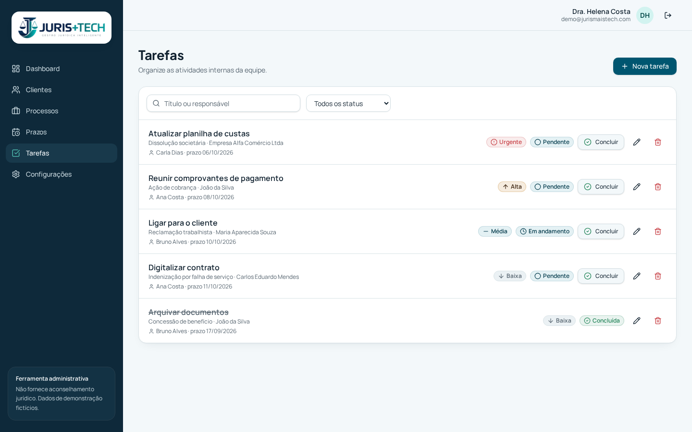
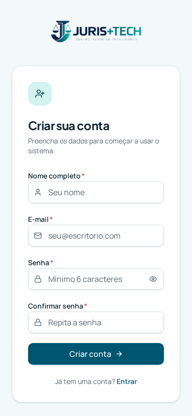

# JURIS+TECH

Gestão administrativa de processos jurídicos para pequenos escritórios de advocacia (MVP de demonstração). **Não fornece aconselhamento jurídico.** Todos os dados são fictícios.

## Telas do sistema

### Login


### Criar conta (novo escritório)


### Dashboard


### Clientes


### Processos


### Prazos


### Tarefas


### Versão celular
 

## Funcionalidades

Login (JWT), dashboard com indicadores, CRUD de clientes, processos, prazos e tarefas, pesquisa e filtros, destaque de prazos atrasados (ícone + texto + cor), atividades recentes, estados de carregamento/vazio/erro, confirmação de exclusão.

## Stack

- Frontend: React 19 + TypeScript, Vite, Tailwind CSS v4, shadcn/ui, Lucide, TanStack Router (roteamento de arquivos), TanStack Query, Axios, React Hook Form, Zod.
- Backend: ASP.NET Core 8 Web API, EF Core, JWT, Swagger — pasta `backend/` (veja backend/README.md).
- Banco: SQL Server (acessado apenas pela API).

```
React → Axios → REST API (ASP.NET Core) → EF Core → SQL Server
```

## Estrutura

```
src/
  routes/        páginas (login, dashboard, clientes, processos, prazos, tarefas, configuracoes)
  components/    common (badges, estados, diálogos), forms, lists, layout, ui (shadcn)
  hooks/         useAuth, useResource (React Query), useLookups
  services/      http/api.ts (Axios + JWT), crud.ts, mock/ (dados fictícios), index.ts
  schemas/       validações Zod
  types/         DTOs
  utils/         formatação, CPF, regra de prazo atrasado
```

## Trocar Mock → API

Defina `VITE_USE_MOCK=false` e `VITE_API_BASE_URL`. Cada serviço usa `createApiCrud(path)` com os endpoints:

| Recurso   | Endpoints                                                    |
| --------- | ------------------------------------------------------------ |
| Auth      | POST /api/auth/login, /register, /refresh, /logout           |
| Clientes  | GET/POST /api/clientes · GET/PUT/DELETE /api/clientes/{id}   |
| Processos | GET/POST /api/processos · GET/PUT/DELETE /api/processos/{id} |
| Prazos    | GET/POST /api/prazos · GET/PUT/DELETE /api/prazos/{id}       |
| Tarefas   | GET/POST /api/tarefas · GET/PUT/DELETE /api/tarefas/{id}     |
| Dashboard | GET /api/dashboard                                           |

## Entidades e relacionamentos

Cliente 1:N Processo · Processo 1:N Prazo · Processo 1:N Tarefa. Campos conforme `src/types/index.ts`.

## Como rodar

### Pré-requisitos

- [.NET 8 SDK](https://dotnet.microsoft.com/download/dotnet/8.0)
- SQL Server (Express, LocalDB ou Docker)
- Node.js 20+ (ou Bun)
- Ferramenta de migrações: `dotnet tool install --global dotnet-ef --version 8.0.8`

### 1. Backend (API .NET + SQL Server)

```bash
cd backend/JurisTech.Api
```

Configure a conexão com o banco em `appsettings.Development.json` (ou via variável de ambiente):

```json
"ConnectionStrings": {
  "DefaultConnection": "Server=localhost;Database=JurisTech;Trusted_Connection=True;TrustServerCertificate=True"
}
```

SQL Server via Docker (opcional):

```bash
docker run -e "ACCEPT_EULA=Y" -e "MSSQL_SA_PASSWORD=Senha@Forte123" -p 1433:1433 -d mcr.microsoft.com/mssql/server:2022-latest
# connection string: Server=localhost,1433;Database=JurisTech;User Id=sa;Password=Senha@Forte123;TrustServerCertificate=True
```

Rode a API:

```bash
dotnet restore
dotnet run
```

- Em desenvolvimento, as migrações e os dados de demonstração são aplicados automaticamente ao iniciar.
- API: `http://localhost:5000/api` · Swagger: `http://localhost:5000/swagger`

Criar/atualizar o banco manualmente:

```bash
dotnet ef database update          # aplica as migrações
dotnet run -- --migrate            # aplica e encerra (útil em deploy)
```

Produção: use o script idempotente `backend/database/migrations.sql` (pode rodar várias vezes) e copie `appsettings.Production.example.json`, definindo a connection string e uma chave `Jwt__Key` forte por variável de ambiente.

Nova alteração no modelo:

```bash
dotnet ef migrations add NomeDaMudanca -o Data/Migrations
dotnet ef migrations script --idempotent -o ../database/migrations.sql
```

### 2. Frontend

```bash
npm install
cp .env.example .env
npm run dev        # http://localhost:8080
```

`.env`:

```
VITE_API_BASE_URL=http://localhost:5000/api
VITE_USE_MOCK=false   # true = dados fictícios no navegador, sem backend
```

> Rode o frontend no mesmo computador da API. A pré-visualização online (https) não consegue acessar `http://localhost`.

### Acesso

- Demonstração: `demo@jurismaistech.com` / `demo123`
- Ou clique em **Cadastre-se** para criar a conta do seu escritório. Cada escritório vê apenas os próprios clientes, processos, prazos e tarefas.

## Segurança

Token JWT em sessionStorage (encerra com a aba; em produção prefira cookie HttpOnly), interceptor 401 → login, nenhuma senha/segredo/connection string no frontend.
